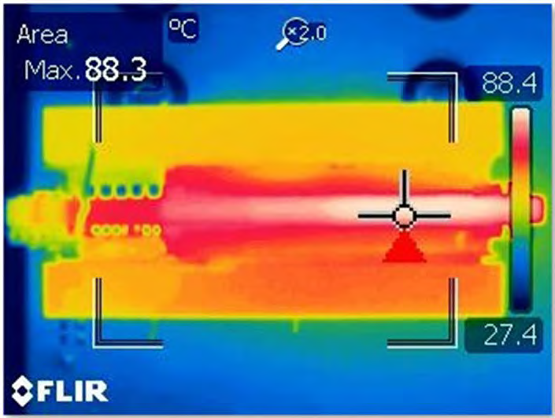

 

# EPC9149: 1 kW LLC 48V/12V 1/8th Brick Size Power Module Firmware

- - -

### 1 MHz 4:1 Fixed Conversion Rate Operation Firmware

<table style="width:100%;">
<tr style="border: none;">
 <td style="border: none; align:center;"> &nbsp; </td>
 <td style="border: none; text-align:center; vertical-align: middle; height:120px; width:300px;"> 
     
 </td>
 <td style="border: none; align:center; width:10px"> &nbsp; </td>
 <td style="border: none; text-align:center; vertical-align: middle;"> 
     
</td>
 <td style="border: none; align:center;"> &nbsp; </td>
</tr>
<tr>
 <td style="border: none; align:center;"> &nbsp; </td>
 <td style="border: none; align:center;" align=center> <b>EPC9149 Power Module</b> </td>
 <td style="border: none; align:center;"> &nbsp; </td>
 <td style="border: none; align:center;" align=center> <b>EPC9533 Test fixture</b></td>
 <td style="border: none; align:center;"> &nbsp; </td>
</tr>
<tr>
<td style="border: none; align:center;" align=center colspan="5">

<a target="_blank" href="https://www.microchip.com/EPC9149" rel="nofollow">
Fixed Conversion Ratio 1 kW LLC, 1/8th Brick Power Module (Part-No. EPC9149)   
with Test Fixture (Part-No. EPC9533)   
Nominal Operation: 36 - 60 V Input, 9 - 15 V Output, 83 A Output
</a>

</td>
</tr>
</table>

- - -

 <!-- start tag for internal references supported by Bitbucket, Github and Visual Studio Code -->

## Table of Contents

- [Summary](#summary)
  - [Related Documentation](#docs)
  - [Development Tools](#devtools)
- [Security and Safety Requirements](#safety)
- [Demo Setup](#setup)
  - [Device Programming](#programming)
  - [Heatsink Assembly](#heatsink)
  - [Bench-Test Operation](#buckmode)

- - - 

## Summary

This code example demonstrates a fixed conversion rate LLC control implementation for dsPIC33CK. It has been specifically developed for the EPC9149 1 kW LLC 8th brick power module, hardware revision 3.2 (see 'Rev' number printed on board top view shown above for verification).

1 kW 48-to-12V LLC 8th Brick Power Module Schematic

The EPC9149 demonstration board is a 1 kW, 48 V input to 12 V output LLC converter that operates as a DC transformer with fixed conversion ratio of 4:1. The simplified schematic diagram is shown above. It features the 100 V rated EPC2218 and 40 V rated EPC2024 GaN FETs, the uP1966A and LMG1020 gate drivers as well as the Microchip dsPIC33CK32MP102 16-bit digital signal controller.

Read more...

Other features include:

- Peak efficiency: 97.5 % at 400 W
- Full-load efficiency: 96.7% @ 12 V delivering 83.3 A output
- 22.9 × 58.4 mm (0.90 × 2.30 inches)
- Low profile: 10 mm total converter thickness without heatsink
- Temperature rise: 70 °C @ 12 V with 83.3 A output (with heatsink kit installed
- Fixed switching frequency: 1 MHz
- Soft startup into full resistive load
- High power density: 1227 W/in³ (excluding pins)

When a voltage between specified minimum and maximum input voltage is applied across the 48V-input terminals of the EPC9533 test fixture, the output will ramp up automatically, providing an unregulated, fixed conversion rate output voltage of 1/4th of the input voltage at the output terminals of the converter. The startup procedure is controlled and executed by the power controller state machine and includes a configurable startup procedure with power-on delay and power-good delay before dropping into continuous conversion mode.

#### Fault Management

An additional fault handler routine continuously monitors incoming ADC data and peripheral status bits and shuts down the power supply if

- the input voltage is outside the defined maximum range (UVLO/OVLO)
- the heat-sink base temperature exceeds 95°C (OTP)
- the total output current exceeds 85 A

The converter automatically recovers from all detected fault conditions listed above.

#### Product Features

- Input Voltage: 36 V to 60 V DC
- Output Voltage: 9 V to 15 V DC (fixed conversion rate of 4:1)
- Center Switching Frequency: 1.0 MHz

 

[[back](#startDoc)]
- - -

## Related Documentation

##### Hardware Documentation

- [EPC9149 1 kW 1/8th Brick LLC Power Module Reference Design Product Website](https://www.microchip.com/EPC9149)
  - [EPC9149 Reference Design Quick Start Guide (QSG)](https://epc-co.com/epc/documents/guides/EPC9149_qsg.pdf)
  - [EPC9149 Reference Design Schematics](https://epc-co.com/epc/documents/schematics/EPC9149_Schematic.pdf)

##### Device Support

***Featured Microchip Technology Products:***

- [dsPIC33CK32MP102 Product Website](https://www.microchip.com/dsPIC33CK32MP102)
  - [dsPIC33CKxxMP10x Device Family Data Sheet](https://www.microchip.com/DS70005363)
  - [dsPIC33CKxxMP10x Device Family Silicon Errata and Data Sheet Clarification](https://www.microchip.com/DS80000809)
  - [Functional Safety Ready dsPIC33 and PIC24 Microcontrollers](https://www.microchip.com/DS90003249)
- [MCP6C02 Shunt Amplifier Product Website](https://www.microchip.com/MCP6C02)
  - [MCP6C02 Zero-Drift, High-Side Current Sense Amplifier](https://www.microchip.com/DS20006129)
- [MCP2221A USB 2.0 to I2C/UART Protocol Converter Product Website](https://www.microchip.com/MCP6C02)
  - [MCP2221A Protocol Converter Data Sheet](https://www.microchip.com/DS20005565)

***Featured Efficient Power Conversion (EPC) Products:***

- [Primary Side: EPC2018 100 V, 60/231 A, Enhancement-Mode GaN Power Transistor](https://epc-co.com/epc/Products/eGaNFETsandICs/EPC2018.aspx)
  - [EPC2018 Data Sheet](https://epc-co.com/epc/Portals/0/epc/documents/datasheets/EPC2018_datasheet.pdf)
- [Secondary Side: EPC2024 40 V, 90/560 A, Enhancement-Mode GaN Power Transistor](https://epc-co.com/epc/Products/eGaNFETsandICs/EPC2024.aspx)
  - [EPC2024 Data Sheet](https://epc-co.com/epc/Portals/0/epc/documents/datasheets/EPC2024_datasheet.pdf)

 

[[back](#startDoc)]
- - -

## Development Tools

##### MPLAB® X Integrated Development Environment (IDE)

- [Requires MPLAB® X IDE, Version v5.40 or later](https://www.microchip.com/mplabx)
  - [Download latest version of MPLAB® X IDE for Windows](https://www.microchip.com/mplabx-ide-windows-installer)
  - [Download latest version of MPLAB® X IDE for Linux](https://www.microchip.com/mplabx-ide-linux-installer)
  - [Download latest version of MPLAB® X IDE for MAC OS](https://www.microchip.com/mplabx-ide-osx-installer)

##### MPLAB® XC16 C-Compiler

- [Requires MPLAB® XC16 Compiler, Version v1.50 or later](https://www.microchip.com/xc16)
  - [Download latest version of MPLAB® XC16 Compiler for Windows](https://www.microchip.com/mplabxc16windows)
  - [Download latest version of MPLAB® XC16 Compiler for Linux](https://www.microchip.com/mplabxc16linux)
  - [Download latest version of MPLAB® XC16 Compiler for MAC OS](https://www.microchip.com/mplabxc16osx)

##### MPLAB® X PowerSmart™ Digital Control Library Designer

- [Optional: PowerSmart&trade; - Digital Control Library Designer, v0.9.14 or later (Pre-Release Version)](https://microchip-pic-avr-tools.github.io/powersmart-dcld/)
  - [Download latest version of PowerSmart&trade; - DCLD for Windows](https://github.com/microchip-pic-avr-tools/powersmart-dcld/archive/release.zip)

##### Microchip Power Board Visualizer GUI Supporting dsPIC33&reg; DSCs

- [Optional: Power Board Visualizer Software](https://www.microchip.com/SWLibraryWeb/product.aspx?product=POWER_BOARD_VISUALIZER)
  - [Download Power Board Visualizer Software for Windows](https://ww1.microchip.com/downloads/en//softwarelibrary/power_board_visualizer/microchip%20power%20board%20visualizer%20installer%201.0.0.0.msi)

 

[[back](#startDoc)]
- - -

## Security and Safety Requirements

Unattended operating power supplies are always a potential safety risk as short circuits or failures of power components can occur at any time where even seemingly small power converters can cause fire or damage connected equipment.

- This development board has not been FCC approved nor certified and must not be used outside a laboratory environment
- Never operate the board unattended
- Only use power supplies delivered with the board or equal, approved laboratory equipment
- Read the user guide for detailed operating instructions to prevent damage to the board or connected equipment

 

[[back](#startDoc)]
- - -

## Setup

The EPC9149/EPC9533 kit comes programmed and ready to be used when unpacked. No reprogramming of the target device is required to operate the board unless features, modes or settings modifications are desired.

The EPC9149 power module must be mounted on the EPC9533 test fixture before power is applied to the development kit. The converter is starting up automatically when more than 36 V DC are applied across the 48V input terminals of the EPC9533 test fixture.

#### 1) Programming New Firmware

The ICSP interface supports all of Microchip’s in-circuit programmers/debuggers, such as

- [MPLAB® ICD4](https://www.microchip.com/icd4)
- [MPLAB® REAL ICE](https://www.microchip.com/realice)
- [MPLAB® PICkit4](https://www.microchip.com/pickit4)

and previously released derivatives.

Show Details...

In case firmware based features or operating modes need to be changed, the Microchip dsPIC33CK controller can be re-programmed using the in-circuit serial programming port (ICSP) available on the 5-pin header provided on the EPC9149 power module. However, due to limited space, a smaller and less common pitch of this connector was used, which may require an interface adapter.

Microchip as well as EPC are providing these standard interface adapters, which both can equally be used to program the target device:

  

    
     
    

        EPC RJ11-to-ICSP 0.05 Pitch / RJ11-to-ICSP 0.10 Pitch Programming Adapter (Part-No. EPC9997) (available on request) 
        <a href="https://www.microchipdirect.com/dev-tools/AC164110-2?allDevTools=true">Microchip RJ11-to-ICSP 0.05 Pitch Programming Adapter (Part-No: AC164110-2)</a>
    

  

**Please read the [EPC9149 Quick Start Guide](https://epc-co.com/epc/documents/guides/EPC9149_qsg.pdf)** to get detailed information about the requirements for setup and operation of this development kit.

 

[[back](#startDoc)]
- - -

#### 2) Mounting the Heat Sink

If the heat sink has not been mounted yet, it is highly recommended to assemble it before high power test procedures are performed. Without heat sink there is a high risk of thermal overstress, shortening the lifetime of the development kit and baring the risk of irreversible damage.

Show Details...

  

    
     
    
EPC9149 Heat Sink Assembly (Top)

  

  

    
     
    
EPC9149 Heat Sink Assembly (Bottom)

  

Please read the user guide for more detailed instructions on the proper mounting procedure.

 

[[back](#startDoc)]
- - -

#### 3) Bench-Test Operation

When connected to a DC bench supply and load, this kit can be operated as fixed conversion rate voltage transformer module (VTM), dividing the input voltage at a fixed conversion rate of 4:1. If the output current exceeds the current limit of 83 A, the converter will shut down.

  

    
     
    
EPC9149 Bench-Test Setup

  

##### ELECTRICAL PERFORMANCE / TEST RESULTS

Test Conditions: VIN = 48 V DC

Show Details...

<table style="border: none; align:center; width:100%">
<tr>
  <td style="border: none; align:center;"> &nbsp; </td>
  <td colspan=2 style="border: none; text-align:center; vertical-align: bottom;"> 
   
  </td>
  <td style="border: none;"> &nbsp; </td>
</tr>
<tr>
  <td style="border: none; align:center;"> &nbsp; </td>
  <td colspan=2 style="border: none; text-align:center; vertical-align: bottom;"> 
    
Efficiency vs. Power Losses

  </td>
  <td style="border: none;"> &nbsp; </td>
</tr>
<tr>
  <td colspan=4 style="border: none; align:center; height:8pt;"> </td>
</tr>
<tr>
  <td style="border: none; align:center;"> &nbsp; </td>
  <td colspan=2 style="border: none; text-align:center; vertical-align: bottom;"> 
   
  </td>
  <td style="border: none;"> &nbsp; </td>
</tr>
<tr>
  <td style="border: none; align:center;"> &nbsp; </td>
  <td colspan=2 style="border: none; text-align:center; vertical-align: bottom;"> 
    
Voltage Droop over Load

  </td>
  <td style="border: none;"> &nbsp; </td>
</tr>
<tr>
  <td colspan=4 style="border: none; align:center; height:8pt;"> </td>
</tr>
<tr>
  <td style="border: none; align:center;"> &nbsp; </td>
  <td colspan=2 style="border: none; text-align:center; vertical-align: bottom;"> 
   
  </td>
  <td style="border: none;"> &nbsp; </td>
</tr>
<tr>
  <td style="border: none; align:center;"> &nbsp; </td>
  <td colspan=2 style="border: none; text-align:center; font-size:14px; vertical-align: bottom; height:10px;"> 
    EPC9149 Output Voltage Startup Timing
  </td>
  <td style="border: none;"> &nbsp; </td>
</tr>
<tr>
  <td colspan=4 style="border: none; align:center; height:8pt;"> </td>
</tr>
<tr>
  <td style="border: none; align:center;"> &nbsp; </td>
  <td style="border: none; text-align:center; vertical-align: middle;"> 
   
  </td>
  <td style="border: none; text-align:center; vertical-align: bottom;"> 
   
  </td>
  <td style="border: none;"> &nbsp; </td>
</tr>
<tr>
  <td style="border: none; align:center;"> &nbsp; </td>
  <td style="border: none; text-align:center; font-size:14px; vertical-align: bottom; height:10px;"> 
    EPC9149 Thermal Behavior
  </td>
  <td style="border: none; text-align:center; font-size:14px; vertical-align: bottom; height:10px;"> 
    EPC9149 Heat Distribution
  </td>
  <td style="border: none;"> &nbsp; </td>
</tr>
</table>

 

[[back](#startDoc)]
- - -
&copy; 2021, Microchip Technology Inc.
